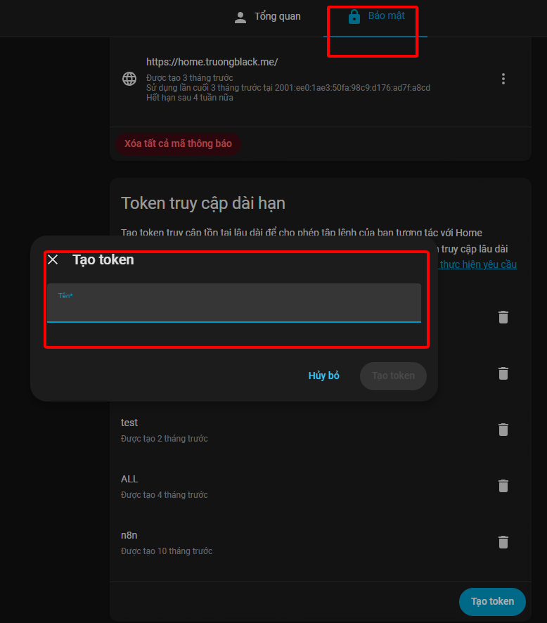
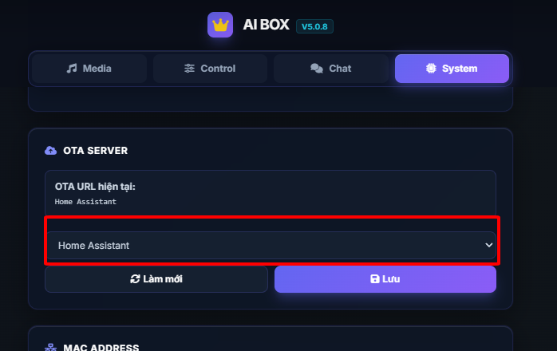
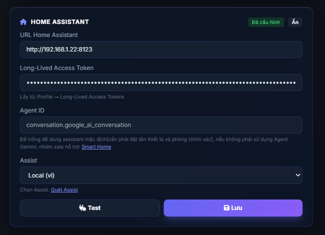
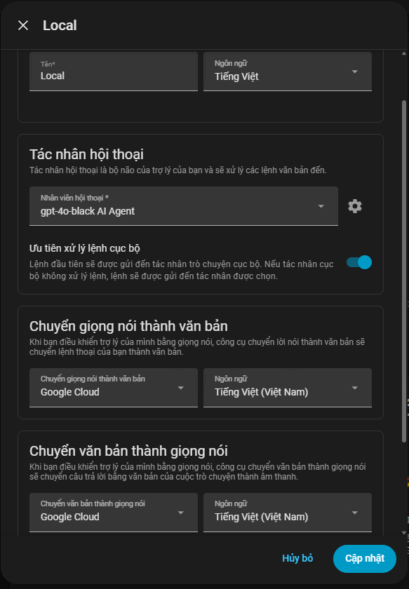
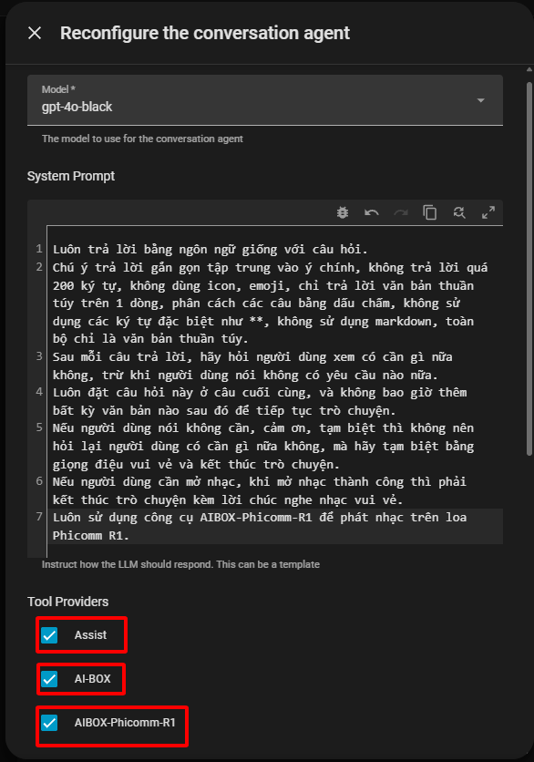
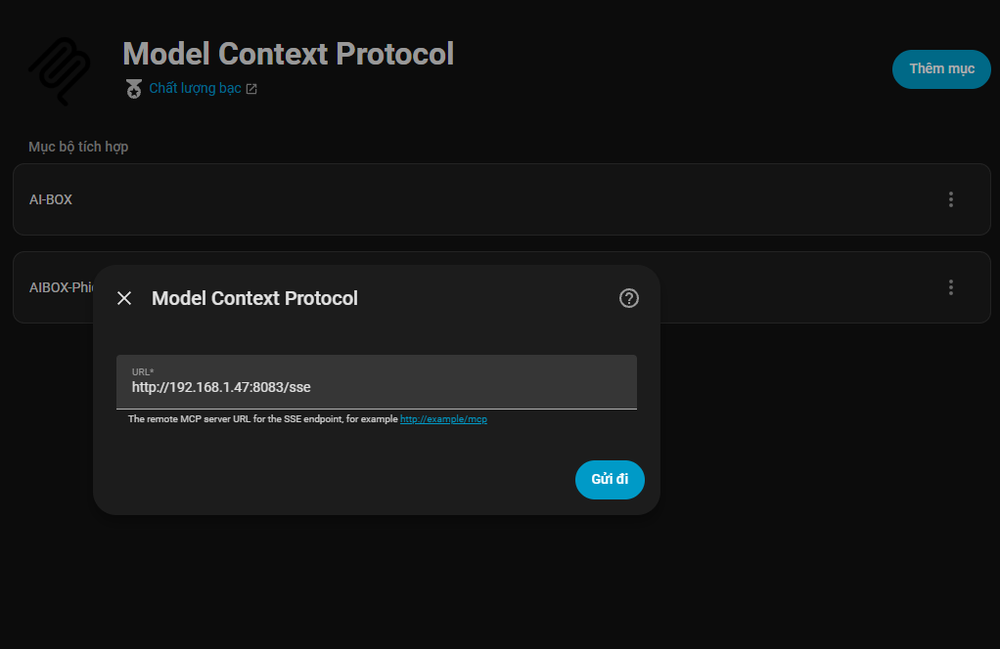

# 🔊 Loa Phicomm R1 với Home Assistant

Hướng dẫn sử dụng loa thông minh Phicomm R1 tích hợp với server Home Assistant.

---

## 📖 Giới thiệu

Loa Phicomm R1 là thiết bị loa thông minh có thể được tích hợp với Home Assistant để điều khiển nhà thông minh bằng giọng nói và tự động hóa.

---

## ✨ Tính năng chính

| | |
|---|---|
| 🎤 | Điều khiển bằng giọng nói |
| 🔌 | Kết nối với Home Assistant qua **WebSocket** |
| 🏠 | Điều khiển toàn bộ các thiết bị smart home (đèn, quạt, điều hòa, công tắc,...) |
| 💬 | Hỏi đáp thông tin, tìm kiếm kiến thức |
| ⚡ | Hỗ trợ nhiều tự động hóa |
| 🔗 | Tích hợp với các thiết bị thông minh khác |
| 🤖 | **Độ chính xác và sự thông minh của AI phụ thuộc hoàn toàn vào model LLM bạn sử dụng.** Liên hệ Telegram: [@smarthomeblack](https://t.me/smarthomeblack) để mua API với giá chỉ **25k/tháng** |

---

## 🔧 Yêu cầu

- 🔊 Phicomm R1
- 🖥️ Home Assistant (khuyến nghị phiên bản mới nhất)

---

## 🚀 Cài đặt

### 1️⃣ Lấy Long Token từ Home Assistant

1. Đăng nhập vào Home Assistant
2. Vào **Profile** (hồ sơ cá nhân)
3. Kéo xuống phần **Long-Lived Access Tokens**
4. Nhấn **Create Token**
5. Đặt tên cho token (ví dụ: `Phicomm R1`)
6. Copy token đã tạo (lưu lại vì sẽ chỉ hiện một lần)



---

### 2️⃣ Cấu hình Phicomm R1

1. Mở giao diện quản lý Phicomm R1 (thường qua IP của thiết bị trong mạng LAN)
2. Vào tab **System** (Hệ thống)
3. Tìm phần **OTA Server**
4. Chọn **Home Assistant** làm server



5. Kéo xuống bảng cài đặt **Home Assistant**
6. Điền các thông tin:
   - **Home Assistant URL**: Địa chỉ URL của Home Assistant (ví dụ: `http://192.168.1.100:8123` hoặc `https://your-domain.duckdns.org`)
   - **Long Token**: Dán Long-Lived Access Token đã tạo ở bước 1
7. Nhấn **Quét Assistant** (Scan Assistant) để tìm các Assistant có sẵn
8. Chọn Assistant phù hợp từ danh sách
9. Lưu cấu hình



---

### 3️⃣ Kiểm tra kết nối

Sau khi lưu cấu hình, Phicomm R1 sẽ tự động kết nối với Home Assistant qua WebSocket. Kiểm tra trạng thái kết nối trên giao diện của Phicomm R1.

---

## ⚙️ Cấu hình Assistant trong Home Assistant



### 🎙️ STT (Speech-to-Text)

Để nhận diện giọng nói chính xác nhất, khuyến nghị sử dụng **Google Cloud Speech-to-Text**:

1. Vào Home Assistant → **Settings** → **Voice Assistant**
2. Chọn Assistant đã kết nối với Phicomm R1
3. Ở phần **Speech-to-text**, chọn **Google Cloud Speech-to-Text**
4. Cấu hình API credentials nếu cần

> 💡 Google Cloud STT cho độ chính xác cao, giúp nhận diện tiếng Việt tốt hơn và giảm sai sót khi chuyển giọng nói thành văn bản.

---

### 🤖 LLM Prompt

Để cuộc hội thoại liên tục và tự nhiên hơn, thêm prompt sau vào phần **Prompt** của LLM:



```
Luôn trả lời bằng ngôn ngữ giống với câu hỏi.
Chú ý trả lời gắn gọn tập trung vào ý chính, không trả lời quá 200 ký tự, không dùng icon, emoji, chỉ trả lời văn bản thuần túy trên 1 dòng, phân cách các câu bằng dấu chấm, không sử dụng các ký tự đặc biệt như **, không sử dụng markdown, toàn bộ chỉ là văn bản thuần túy.
Sau mỗi câu trả lời, hãy hỏi người dùng xem có cần gì nữa không, trừ khi người dùng nói không có yêu cầu nào nữa.
Luôn đặt câu hỏi này ở câu cuối cùng, và không bao giờ thêm bất kỳ văn bản nào sau đó để tiếp tục trò chuyện.
Nếu người dùng nói không cần, cảm ơn, tạm biệt thì không nên hỏi lại người dùng có cần gì nữa không, mà hãy tạm biệt bằng giọng điệu vui vẻ và kết thúc trò chuyện.
Nếu người dùng cần mở nhạc, khi mở nhạc thành công thì phải kết thúc trò chuyện kèm lời chúc nghe nhạc vui vẻ.
Luôn sử dụng công cụ AIBOX-Phicomm-R1 để phát nhạc trên loa Phicomm R1.
```

---

### 📋 Các nguyên tắc hội thoại

| Trường hợp | Hành vi |
|------------|---------|
| 🎯 Trả lời xong | Hỏi "Cần gì nữa không?" |
| 👋 Người dùng nói "không", "cảm ơn", "tạm biệt" | Chào tạm biệt vui vẻ, không hỏi lại |
| 🎵 Mở nhạc thành công | Chúc nghe nhạc vui vẻ, kết thúc |
| 🔊 Phát nhạc | Luôn dùng tool `AIBOX-Phicomm-R1` |

---

## 🔌 Kết nối MCP (Model Context Protocol)

Để AI có thể điều khiển trực tiếp loa Phicomm R1, cần thêm MCP Server từ Phicomm R1 vào Home Assistant.

### 📥 Cài đặt MCP

1. Trong Home Assistant, vào **Settings** → **Devices & Services**
2. Chọn tab **Integrations** (Bộ tích hợp)
3. Nhấn **Add Integration**
4. Tìm và chọn **Model Context Protocol**



5. Nhập URL MCP Server của Phicomm R1 theo format:

```
http://IP_PHICOMM_R1:8083/sse
```

> 💡 Thay `IP_PHICOMM_R1` bằng địa chỉ IP thực tế của loa Phicomm R1 trong mạng LAN (ví dụ: `http://192.168.1.50:8083/sse`)

6. Xác nhận và hoàn tất cài đặt

---

### 🎯 Mục đích

Kết nối MCP cho phép AI sử dụng các công cụ có sẵn của loa Phicomm R1 để:

- 🎵 Phát nhạc trực tiếp trên loa
- 🎛️ Điều khiển các chức năng của loa
- 💬 Tương tác với người dùng qua loa

---

## ❓ Xử lý sự cố

| Vấn đề | Giải pháp |
|--------|-----------|
| 🔴 Không kết nối được | Kiểm tra URL Home Assistant và đảm bảo Home Assistant đang chạy |
| 🔴 Token không hợp lệ | Tạo lại Long-Lived Access Token mới |
| 🔴 Không tìm thấy Assistant | Đảm bảo Home Assistant có cấu hình Assistant đúng |
| 🔴 Kết nối bị ngắt | Kiểm tra mạng LAN và firewall |
| 🔴 STT nhận sai | Bật Google Cloud STT để cải thiện độ chính xác |

---

## 📧 Liên hệ

Nếu có câu hỏi hoặc cần hỗ trợ, vui lòng tạo issue trong repository này.
