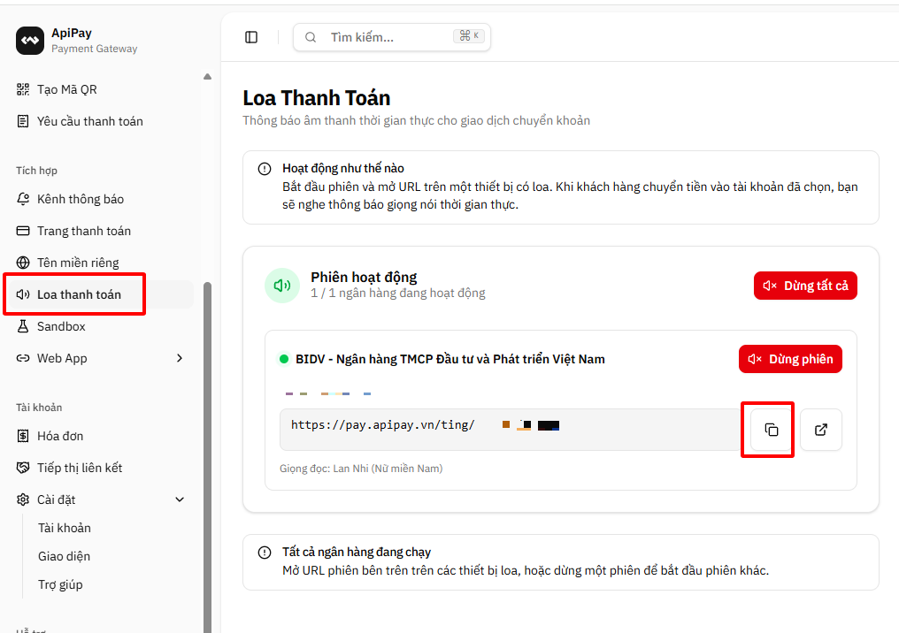

# 💰 Thông báo biến động số dư với Apipay

Hướng dẫn tích hợp thông báo biến động số dư ngân hàng trực tiếp trên loa Phicomm R1 thông qua [Apipay](https://apipay.vn/?ref=truongbber).

---

## 📖 Giới thiệu

Apipay là dịch vụ thông báo biến động số dư tài khoản ngân hàng bằng giọng nói. Khi có tiền vào/ra tài khoản, loa Phicomm R1 sẽ tự động đọc thông báo ngay lập tức — không cần chờ tin nhắn SMS, không cần mở điện thoại.

💵 **Giá chỉ 100.000đ/tháng, không giới hạn số lượng thông báo.**

---

## 🚀 Cài đặt

### 1️⃣ Truy cập Apipay

1. Mở trình duyệt và vào trang chủ Apipay: **[https://apipay.vn/](https://apipay.vn/?ref=truongbber)**

---

### 2️⃣ Đăng ký / Đăng nhập tài khoản

1. Nhấn **Đăng ký** để tạo tài khoản mới (hoặc **Đăng nhập** nếu đã có tài khoản)
2. Điền đầy đủ thông tin theo yêu cầu
3. Xác nhận để hoàn tất đăng ký

---

### 3️⃣ Thêm tài khoản ngân hàng

1. Sau khi đăng nhập, vào phần quản lý tài khoản
2. Nhấn **Thêm tài khoản ngân hàng**
3. Chọn ngân hàng và điền thông tin tài khoản của bạn
4. Lưu lại để hoàn tất

---

### 4️⃣ Tạo phiên đọc thông báo và cài đặt vào loa

Làm theo hướng dẫn như ảnh bên dưới:

1. **Chọn giọng đọc** bất kỳ mà bạn thích
2. Bấm **Tạo phiên**
3. **Copy link phiên** vừa tạo
4. Dán link phiên vào phần cài đặt của Loa Phicomm R1

---

## ⚠️ Lưu ý quan trọng

> 🚨 **Vui lòng đọc kỹ để tránh lỗi kết nối!**

| | Lưu ý |
|---|---|
| 🔒 | **KHÔNG chia sẻ URL phiên cho bất kỳ ai** — link phiên là của riêng bạn |
| ♾️ | Phiên sẽ hoạt động **mãi mãi**, không cần tạo lại định kỳ |
| ⛔ | **KHÔNG được bấm "Dừng phiên"** — nếu dừng, loa sẽ **không kết nối được** |
| 🔄 | Nếu bạn tạo lại phiên mới, phải **copy lại link mới** và dán lại vào cài đặt của loa |

---

## ❓ Xử lý sự cố

| Vấn đề | Giải pháp |
|--------|-----------|
| 🔴 Loa không đọc thông báo | Kiểm tra đã dán đúng link phiên vào cài đặt loa chưa |
| 🔴 Kết nối bị ngắt | Kiểm tra xem bạn có lỡ bấm **"Dừng phiên"** không — nếu có, tạo lại phiên mới và copy link mới vào loa |
| 🔴 Đã tạo phiên mới nhưng loa không nhận | Copy lại **link phiên mới nhất** và dán lại vào cài đặt của loa |
| 🔴 Không đăng nhập được | Kiểm tra lại thông tin đăng ký hoặc liên hệ hỗ trợ Apipay |

---

## 📧 Liên hệ

Nếu có câu hỏi hoặc cần hỗ trợ, vui lòng tạo issue trong repository này.
